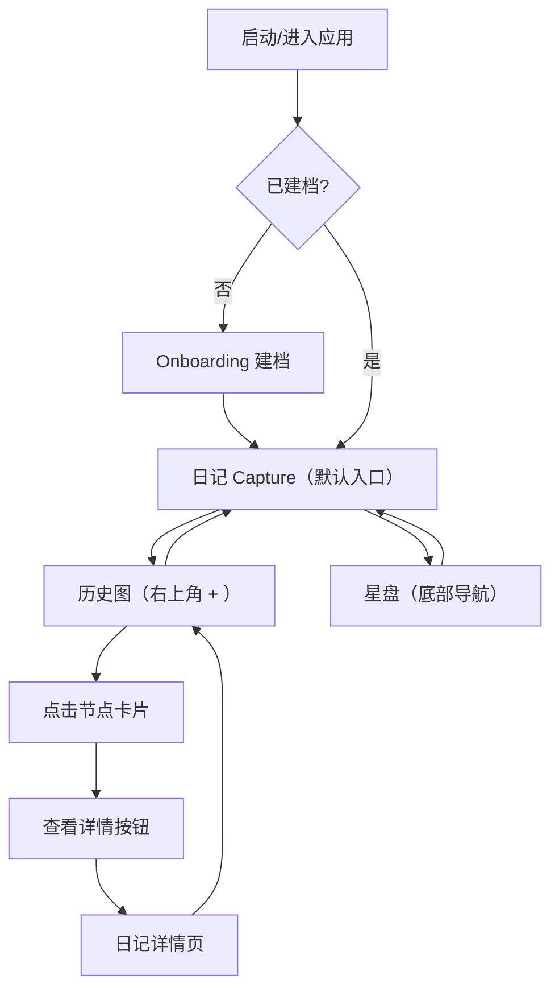

## 1. Product Overview

AstroJournal 是一款极简「复古中世纪羊皮纸」风格的个人星相日记应用。
它抛弃传统占星软件的臃肿：打开应用即进入日记记录（Capture），没有“首页/列表/瀑布流”，只保留“当下记录”和“星盘”。历史以折线图的方式被动存在，像羊皮卷轴上的墨迹而非信息流。

## 2. Core Features

### 2.2 Feature Module

我们的 MVP 需求由以下页面组成（严格极简）：

1. **建档页（Onboarding）**：第一次启动时填写个人出生信息，完成后不再打扰。
2. **日记 Capture（默认入口）**：全屏无边框输入框，顶部一行微小星象文案，右上角一个极小“+”进入历史。
3. **历史图（History Graph）**：横向可滚动折线图（时间 → 综合运势分），点击节点以动画弹出卡片展示日记摘要与分数，提供查看详情入口。
4. **日记详情（Diary Detail）**：展示完整内容、时间与星象，并支持修改。
5. **星盘（Chart）**：极简星相交互（先支持本命盘/关键点位的轻交互，避免复杂菜单）。

### 2.3 Page Details

| Page Name          | Module Name | Feature description                           |
| ------------------ | ----------- | --------------------------------------------- |
| 建档页（Onboarding）    | 必填信息        | 姓名、出生日期（精确到分钟）、出生地（城市→经纬度/时区）                 |
| 建档页（Onboarding）    | 选填信息        | 现居地、教育经历、工作经历、储蓄级别（符号化滑块/刻度）                  |
| 日记 Capture（默认入口）   | 全屏输入        | 无边框多行输入；placeholder：此刻有什么想留下的？                |
| 日记 Capture（默认入口）   | 顶部微文案       | 一行极小字体显示“此刻月亮在××座”等（装饰/衬托，不抢正文）               |
| 日记 Capture（默认入口）   | 静默保存        | 点击发送后输入内容以“星尘消散”动效清空；静默写入本地；不展示列表             |
| 日记 Capture（默认入口）   | *历史入口*      | 右上角极小“+”进入历史图（或作为叠加层/新页面）                     |
| 历史图（History Graph） | 折线图主视图      | X=时间，Y=星相+情绪综合运势分；支持横向滚动与缩放（可选）               |
| 历史图（History Graph） | 节点交互        | 点击发光节点，卡片以动画（从无到从小到大）弹出，展示日记摘要、运势分数以及“查看详情”按钮 |
| 日记详情（Diary Detail） | 详情展示        | 包含完整日记内容、记录时间以及星象情况。右上角提供“修改”按钮               |
| 日记详情（Diary Detail） | 修改确认        | 点击修改后弹出二次确认对话框，防止误操作                          |
| 星盘（Chart）          | 极简星盘        | 以出生信息生成本命盘；优先支持查看太阳/月亮/上升与主要宫位提示              |

## 3. Core Process

* 首次启动：打开应用 → 若未建档则进入 Onboarding → 完成后进入日记 Capture。

* 日常记录：打开应用即是日记 Capture → 输入 → 点击发送 → 星尘消散 → 静默保存（不跳转、不出现列表）。

* 回望历史：在日记 Capture 右上角点击“+” → 进入历史折线图 → 点击节点弹出包含摘要和分数的卡片 → 点击“查看详情”进入日记详情页。

* 日记详情：查看完整日记内容、时间及星象 → 点击右上角修改按钮 → 弹出确认对话框 → 确认后进行修改。

