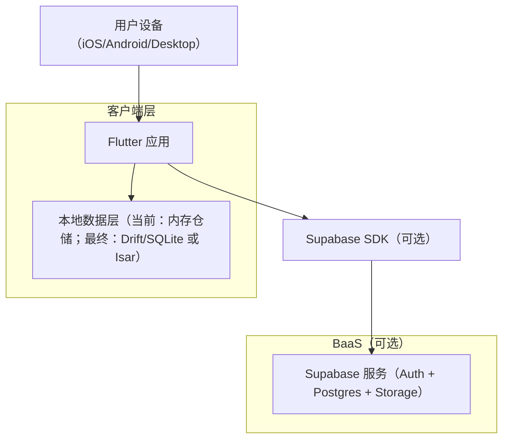

## 1. Architecture Design



## 2. Technology Description

* **Frontend**: <Flutter@3.x> + <Dart@3.x>

* **状态管理**: Riverpod\@2（含 StateNotifier/AsyncNotifier）

* **路由**: go\_router（声明式路由；两 Tab 使用 StatefulShellRoute）

* **本地存储 (最终目标)**:

  * **Drift (SQLite)**: 结构化查询与迁移能力强，适合长期数据管理。

  * **Isar**: 高性能 NoSQL，适合快速迭代。

  * **当前状态**: 为了规避环境中的代码生成 (CodeGen) 限制，暂时采用**手写内存仓储 (In-memory Repository)** 实现 MVP 逻辑。

* **文本输入**: 原生 TextField（纯文本优先）。

* **图表**: fl\_chart（情绪/记录频率折线图）。

* **星盘计算**: 先存快照、后补算法。

## 3. Route Definitions
 
 | Route         | Purpose          |
 | ------------- | ---------------- |
 | `/`           | 日记 Capture（默认入口） |
 | `/onboarding` | 第一次启动建档          |
 | `/history`    | 历史折线图（全屏页）       |
 | `/history/detail/:id` | 日记详情页（含修改入口） |
 | `/chart`      | 星盘（底部导航第二个 Tab）  |

## 4. Current Progress (MVP Phase)

* [x] **UI 框架搭建**: 基于“复古羊皮纸”设计规范的主题与布局。

* [x] **核心功能开发**:

  * Onboarding 建档流程。

  * Capture 沉浸式日记记录（含模拟墨迹晕染反馈）。

  * History 可视化历史回望。

* [x] **架构解耦**: 数据访问层已通过 `AppDatabase` 接口与业务逻辑解耦，支持未来无缝切换持久化引擎。

## 5. Long-term Goal: Robust Persistence

虽然 MVP 阶段采用了内存存储以快速推进开发，但项目的最终目标仍是实现**完全离线的长期化存储**：

1. **持久化引擎**: 优先回归 **Drift (SQLite)**，确保用户日记在应用重启后依然存在。
2. **数据迁移**: 建立稳定的数据库 Schema 迁移机制，支持版本更新。
3. **加密存储**: 考虑接入 `flutter_secure_storage` 对敏感日记内容进行加密，保障个人隐私。

## 6. Data Model (Handwritten Version)

为了保持开发灵活性，当前使用纯 Dart 类定义数据模型：

```dart
// Profile 模型
class Profile {
  final String id;
  final String displayName;
  final DateTime birthDateTime;
  final String birthPlaceName;
  final DateTime createdAt;
  // ... constructors & methods
}

// JournalEntry 模型
class JournalEntry {
  final String id;
  final String profileId;
  final DateTime capturedAt;
  final String bodyText;
  final int? fortuneScore;
  final String? astroSnapshot;
  final DateTime createdAt;
  // ... constructors & methods
}
```

